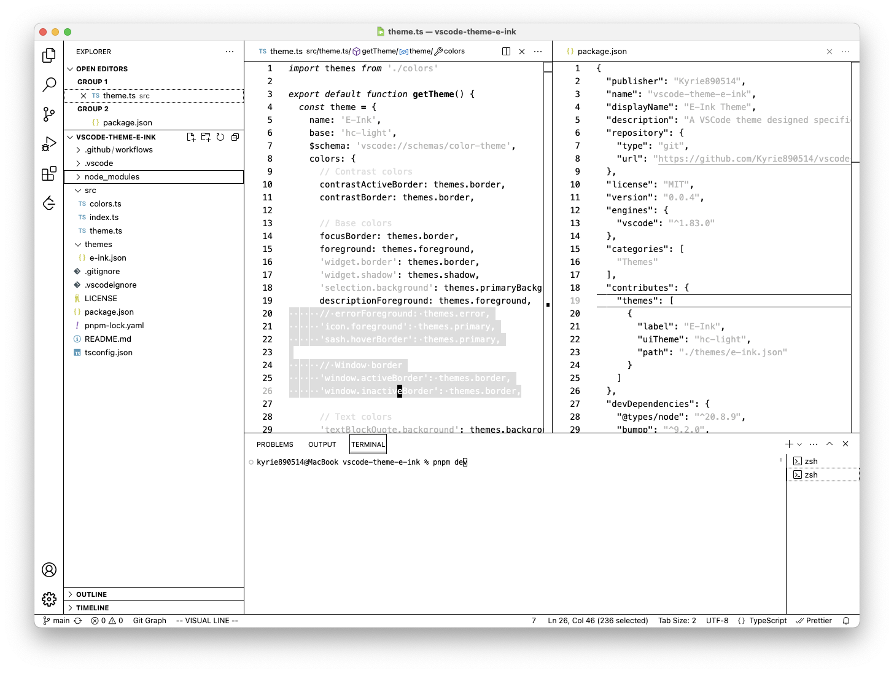

# E-Ink Theme for VSCode

This is a VSCode theme designed specifically for E-Ink displays.

> The color gray may look too light in a normal display, but believe me, try it and you will find it plays well in an E-Ink display, at least it does well in my DASUNG 13.3-inch display with Text Mode.

## Thanks

If you find a bug or have any ideas to improve the theme, feel free to submit an issue or pull request on the [project repo](https://github.com/Kyrie890514/vscode-theme-e-ink), I would be very grateful.

## License

MIT - Copyright (c) 2023 Kyrie890514
